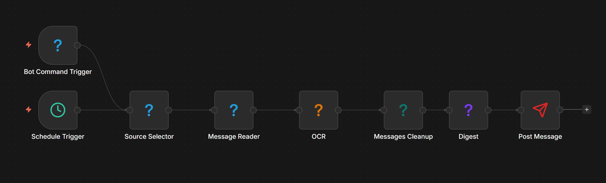

# TG-Dog

TG-Dog is a self-hosted Telegram automation project built around `n8n`.

The idea is simple: Telegram can be your input, your trigger, your control panel, and your output. You pick chats, read messages, run OCR if needed, pass the text through AI or any other `n8n` logic, then send the result somewhere useful.

It can be a digest. It can be a reply draft. It can be classification, extraction, notes, routing, posting, alerts, or some weird private bot workflow you made for yourself.

So no, this is not just a "digest bot". Digest is only one of the obvious things you can build with it.



*Example workflow in `n8n`: Telegram messages come in, the flow processes them, then sends the result where it needs to go.*

## 🔥 What It Can Do

Right now you can use TG-Dog to:

- turn noisy chats into something readable and useful
- OCR screenshots and image posts from Telegram
- trigger workflows from a bot command like `/run`
- react to new messages in real time
- post the final result back to Telegram as your account or as a bot
- generate AI comments, summaries, rewrites, or structured notes from chat content
- rank, classify, or sort messages before routing them somewhere else
- extract structured data from messy chat text
- generate labels, tags, follow-up actions, or internal notes
- make digests, briefs, reports, replies, or action items from the same input
- enrich Telegram content and then pass it into other `n8n` services like Notion, Google Sheets, email, Slack, webhooks, or your own APIs

If you already know `n8n`, then the short version is simple: this project gives you Telegram as a proper workflow input and output layer.

## 🚀 First Launch

### 1. Create `.env`

```bash
cp .env.example .env
```

Then replace the placeholder secrets.

At minimum, set these:

- `POSTGRES_PASSWORD`
- `APP_MASTER_KEY`

If you also want bot commands or bot delivery, add:

- `TELEGRAM_BOT_TOKEN`

If you want bot webhook mode, also set:

- `TELEGRAM_BOT_WEBHOOK_BASE_URL`

### 2. Start everything

```bash
make up
```

That boots the Docker stack and handles first-time onboarding when needed.

Named Docker volumes are created automatically on first boot.

### 3. Open `n8n`

- URL: `http://localhost:50000`
- On a fresh install, complete the standard `n8n` owner setup in the browser.
- On later runs, log in with the owner email and password you created there.

### 4. Connect your Telegram account

On the first run, TG-Dog asks for:

- `api_id`
- `api_hash`
- phone number
- login code from Telegram
- 2FA password if you use it

If you started everything in detached mode and skipped the wizard by accident, just run:

```bash
make connect-telegram
```

### 5. Log in the AI worker once

```bash
docker compose exec -it opencode-worker opencode providers login
```

Right now that worker powers the main AI text step. Summaries are one use case, but rewrites, extraction, classification, comments, and other text tasks fit the same path too.

## 📲 Telegram Setup

### Your Telegram account

TG-Dog uses real Telegram client access through `Telethon`, so you need your own Telegram app credentials from:

- `https://my.telegram.org/apps`

You need two things:

- `api_id`
- `api_hash`

If Telegram's developer portal starts acting like a diva, the detailed guides are here:

- `docs/user/telegram-app-setup.md`
- `docs/user/connect-account.md`

### Your bot

If you want bot delivery or `/run` style commands:

1. Open `@BotFather` in Telegram.
2. Create a bot with `/newbot`.
3. Copy the token.
4. Put it into `.env` as `TELEGRAM_BOT_TOKEN`.

That's it for the basic bot setup.

## 🧪 Build Your First Workflow

The easiest first flow looks like this:

1. Create a new workflow in `n8n`.
2. Add a trigger.
3. Pick Telegram chats as sources.
4. Read messages.
5. Optionally run OCR on images.
6. Clean the text.
7. Run your AI step.
8. Post the result back to Telegram.

You do not need to memorize every custom node on day one.

Just think in this order:

- where messages come from
- what should happen to them
- where the final result should go

That mindset is enough to get moving.

## 💡 Real Things You Can Build

### "Clean this mess up for me"

Take a chaotic stream of Telegram posts, strip the noise, normalize the text, and turn it into something readable.

### "Write the reply for me"

Read incoming messages, pass the text through your AI step, draft a response, and send it back to Telegram or hand it off for review.

### "Turn raw chat text into structured data"

Take unstructured Telegram messages and extract fields, decisions, tags, tasks, names, links, or anything else you want to feed into the next step.

### "Make me a digest"

Pick a few channels, read recent messages, build one summary, and send it to your Saved Messages or another chat.

### "Turn Telegram into an input source"

Use Telegram chats as raw input, then push the processed result into other `n8n` nodes: tables, docs, alerts, APIs, CRMs, or wherever else you need it.

### "Sort the useful stuff from the junk"

Pull messages from several chats, rank or classify them, then route the good stuff into separate paths.

### "Add brains to a Telegram bot"

Use bot commands as the entry point, then let the workflow summarize, explain, comment, classify, answer, or transform whatever the user sent.

### "Moderate or triage incoming stuff"

Pull messages from chats, channels, or bot commands, detect what matters, then route urgent or high-value items into separate branches.

### "Watch this chat and react"

Use a realtime trigger and run a workflow whenever a new message appears in one selected dialog.

### "Let me trigger it manually from Telegram"

Use a bot command trigger so `/run` kicks off the workflow on demand.

### "Read image-heavy chats"

Enable OCR and pull text out of screenshots, posters, and other image posts before processing them.

### "Build a private operator bot"

Use a bot command trigger plus standard `n8n` nodes to make your own control panel in Telegram: actions, lookups, notes, reports, follow-ups, whatever fits your flow.

### "Glue Telegram to the rest of your stack"

Telegram can be your inbox, trigger source, operator console, or delivery channel, while `n8n` handles the rest.

That means one workflow can easily become:

- Telegram -> OCR -> AI rewrite -> Telegram post
- Telegram -> AI extract -> Google Sheets row
- Telegram -> classify -> branch by label -> different destinations
- Telegram -> summarize -> Notion page
- Telegram -> bot command -> call your internal API -> send result back
- Telegram -> parse order/request -> webhook/API -> confirmation message
- Telegram -> extract leads/issues/tasks -> CRM or tracker update

## 🛠️ Useful Commands

```bash
make up
make down
make restart
make logs
make connect-telegram
make reset-telegram
make reset-data
make test
make migrate
docker compose exec -it opencode-worker opencode providers login
```

## ⚠️ Important Stuff You Should Not Ignore

- Do **not** commit `.env`.
- Do **not** dump Telegram session data into git.
- Do **not** publish Docker volume data.
- `app` and `api` mount `/var/run/docker.sock`, so treat them as high-trust containers.

## 📚 Want More Details?

Start here:

- `docs/user/quickstart.md`
- `docs/user/telegram-app-setup.md`
- `docs/user/connect-account.md`
- `docs/user/run-workflow-in-n8n.md`
- `docs/user/troubleshooting.md`

Operator docs live here:

- `docs/operator/architecture.md`
- `docs/operator/runbooks.md`
- `docs/operator/contracts.md`

## 🐾 The Short Version

If you want to build Telegram-based workflows in `n8n`, this project gives you the missing pieces: real Telegram access, OCR, AI text processing, and delivery back to Telegram or into the rest of your stack.

That is the whole point of TG-Dog.
